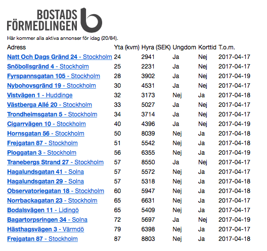

# bostadskon

> I use this to find interesting openings in the Bostadskön in Stockholm. Feel free to use and modify as you wish.

## Example usage

```
0 6 * * * (docker run --rm williamboman/bostadskon 2> /dev/null | mail -a "Content-type: text/html" -s "Bostadskön" <your mail>) &> /dev/null
```

## Example HTML output


